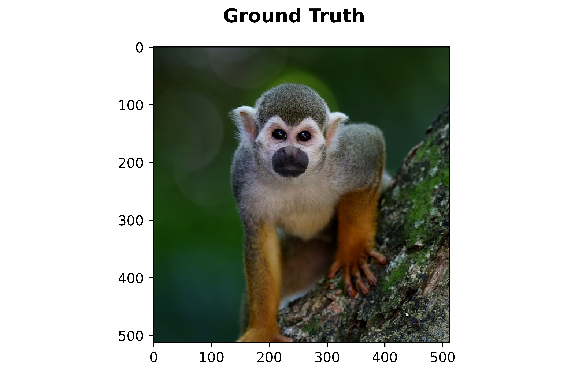
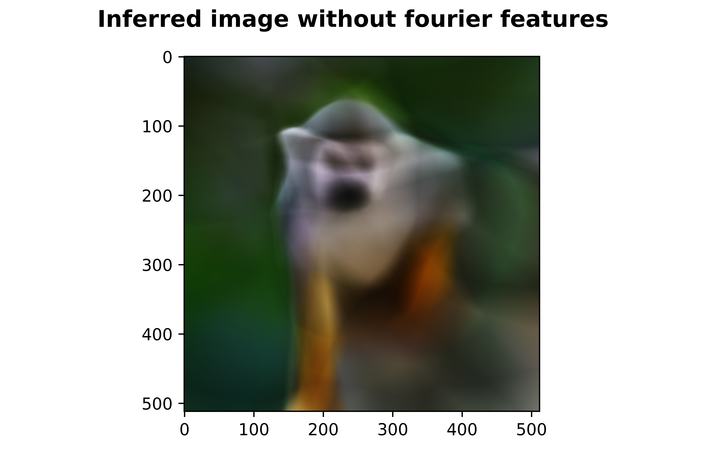
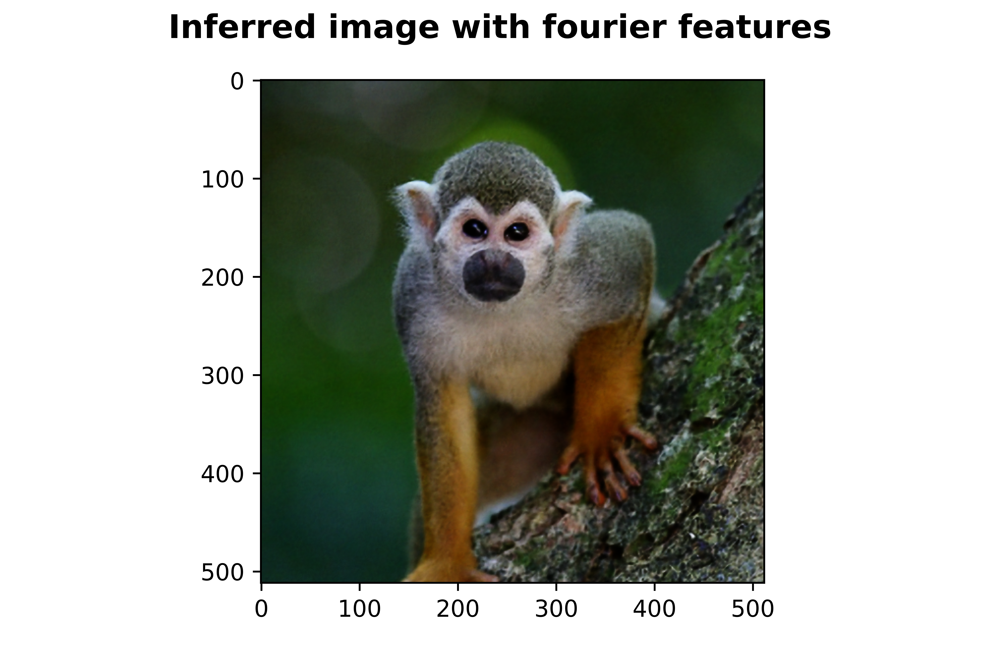

# Fourier Features Let Networks Learn High Frequency Functions in Low Dimensional Domains

Replicated some JAX snippets in TF2 to see how passing the input through Fourier feature mappings performs on different images and parameters. 
This method enabled the NERF implementation by Mildenhall et al. to render photorealistic scenes. 
However, it can also be applied to other problems such as 2D-image regression. 

Thanks to the original authors:
Matthew Tancik, Pratul P. Srinivasan, Ben Mildenhall, Sara Fridovich-Keil, Nithin Raghavan, Utkarsh Singhal, Ravi Ramamoorthi, Jonathan T. Barron, & Ren Ng (2020). Fourier Features Let Networks Learn High Frequency Functions in Low Dimensional Domains. NeurIPS 2020 (spotlight).

Project-page with links to the original code and the paper: 
https://bmild.github.io/fourfeat/

{:height="50%" width="50%"}{:height="50%" width="50%"}{:height="50%" width="50%"}

